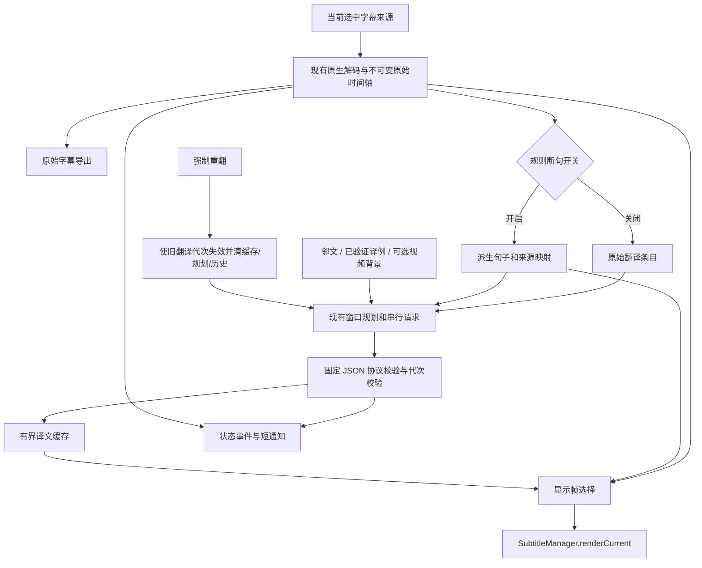

# 基于 nightly-24 的 Kiss 字幕功能增量实施计划

日期：2026-09-20，Asia/Hong_Kong。**状态：研究完成，实施进行中——K0–K2 与 K3、K6 已实现并本地验证，K4/K5（规则断句）与最终 GitHub 门禁未完成；逐项状态见 §8，证据见 [实施状态](evidence/kiss-implementation-status-2026-09-20.md)。**

## 1. 目标与成功基线

在用户已验收的 nightly-24 工作流上加入智能上下文、规则断句、强制重翻和字幕加载通知。依据[固定版本源码研究](../research/kiss-subtitle-features-2026-09-20.md)，不重新实现来源获取、Key 输入或已修复的 DeepSeek 传输协议。

计划基线为 `production` / `91982d5e`；已验收应用 SHA `164508024b6611327f6349295a967b5385ebb4c0`。现有 456 tests / CI 成功是历史证据，新增代码仍须在同一最终 SHA 上通过当前门禁。开始实施时重新核对 HEAD 和工作树，保留其他任务改动。

**保持的行为：**用户选中的轨道决定唯一字幕来源；原始字幕可在无 Key、AI 关闭时播放/导出；AI 关闭立即回原文；单条失败不把报错当译文；字幕显示只有一个写入点；seek/换轨/换视频/release 拒绝旧结果；配置菜单可见保存结果；本地诊断不记录正文和凭据。

本次增加可选派生句子显示，明确扩展旧方案“始终按 native cue 显示”的限制；原始时间轴、来源身份和原始导出仍保留。新增模型协议由项目独立编写，不复制 Kiss 提示词。

## 2. 用户看到的行为与默认值

| 功能入口 | 建议行为 | 升级默认 |
| --- | --- | --- |
| 智能上下文 | `基础邻文 / 连贯上下文 / 视频增强` 三档。基础沿用前后原文；连贯增加同片段已验证译例；视频增强额外分析一次主题/术语 | 基础邻文，保留既有调用成本模式 |
| 规则断句 | `保持原字幕 / 规则断句`。启用后，在 AI 双语/仅译文模式按完整句子翻译和显示；原文模式与 AI 关闭仍用 native 原字幕 | 保持原字幕 |
| 强制重翻当前字幕 | 清当前视频当前轨的译文，从当前位置重新翻译；已有原字幕保留，原始字幕不重新下载 | 动作按钮，无自动重翻开关 |
| 字幕加载通知 | 播放器短提示，显示准备、原字幕就绪、当前片段译文就绪/失败；可关闭 | 开启；重复状态不重复打扰 |

智能上下文与规则断句为独立选择。切换上下文档位或断句策略，说明“将重新翻译当前字幕，可能增加调用”，保存后一次性更新配置身份并重建翻译会话；不通过反复开关 AI 模拟变更。切显示模式、关闭通知只影响显示，不清缓存或启动请求。所有新增设置重开菜单和重启保持；AI 开关继续沿用既有作用域。

**强制重翻的适配说明：**Kiss 同名选项用于“另一个翻译服务替换 AI 断句草稿”。本项目没有第二个断句服务，改为有用且明确的手动重新生成动作；本计划确认也包含这一语义适配。如要求逐项复制上游双服务草稿行为，应另行扩范围，不能偷偷引入第二服务。

按钮说明：“清除此视频当前字幕轨的译文，从当前位置重新翻译，可能增加用量。”它清当前来源整个会话的译文；不会立刻翻译全片，之前位置在用户回看时按窗口补翻。保留同配置的视频背景摘要，清翻译历史，避免原错误译法继续影响新结果。

## 3. 数据流与最小改动接缝

新增代码优先放在 `common/src/main/java/com/liskovsoft/smartyoutubetv2/common/exoplayer/other/`（下文记为 `other/`）。沿用 presenter 装配；纯算法与状态策略可单测。建议新增少量明确职责的类：`SubtitleContext`/`SubtitleContextBuilder`、`SubtitleContextAnalyzer`、`SubtitleRuleSegmenter`、`SubtitleSegmentTimeline`、`SubtitleLoadNotificationPolicy`；确实需要时增加边界显示调度器。不要先造通用工作流框架、第二个播放器或多供应商层。

## 4. 必须先固定的技术契约

### 4.1 身份与并发

- 原始来源仍用现有 source key / snapshot fingerprint。规则版本、规则参数、上下文档位进入翻译配置身份；视频摘要内容冻结后加入完整摘要的哈希。不得用摘要前 50 字符或带敏感数据的日志键。
- 翻译请求、缓存写入、历史提交、通知和显示共用捕获的工作身份：现有 player/source/track/seek 代次，加 translation generation。配置变更、重翻先使旧身份无效，再 cancel；响应到达时不能取“当前 token”冒充请求 token。
- 规则句子 ID 由源 fingerprint、规则版本和有序成员 ID/边界稳定生成；不能只取句子文字。cache 至少隔离配置/派生身份；保留现有 2,000 项、2MiB 上限与独立失败预算。
- 视频摘要与字幕翻译共享一个在途槽位/最小请求间隔。首版在首批翻译前完成或放弃一次摘要，常规翻译开始后摘要不插队。手动连接测试也不能与新的摘要/翻译偷偷并发：复用简单协调入口，在忙时明确反馈或先取消并等待终止，测试结束恢复原工作。
- 原始字幕抓取沿用独立下载去重机制，不占 AI 推理槽位。取消网络调用后须等该调用终止回调才复用 AI 槽位；协议层为每次尝试只发一次终态，旧回调不得释放新请求槽位。

### 4.2 上下文协议与初始预算

这些数字是拟定的可测试工程初值，不是已测效果或照搬上游默认。

| 项目 | 初值/约束 |
| --- | --- |
| 翻译窗口/批量 | 保留向前 60s；首批至多 4 项，后续至多 20 项 |
| 翻译输入文本总量 | 条目、邻文、译例、摘要合计不超过 6,000 Unicode code points；固定系统指令及已有受限风格另计；完整序列化请求另限 128KiB UTF-8 |
| 邻文 | 全时间轴中锚点之前最多 3 项、之后最多 2 项；各 500 code points，按时间正序，稳定 ID 去重，排除当前批条目 |
| 连贯译例 | 最多前 2 个成功批次中的 8 对原文/译文，总计 1,000 code points；只取当前播放点之前已验证且未跨 seek 的条目 |
| 视频采样 | 从该来源开头取有序、不重复的原文，至多 6,000 code points；不足 200 跳过；标题最多 200，简介最多 500，元数据缺失不阻塞 |
| 摘要结果 | 独立固定 JSON schema：主题短述与术语列表；主题至多 300、术语最多 12 对、总计至多 800 code points；不推断没有证据的性别/身份 |
| 摘要传输 | 完整输入含 metadata 至多 6,700 code points，序列化请求至多 128KiB；output 至多 1,024 tokens，response 至多 16KiB，超限受控回退 |
| 摘要调用 | 同视频/来源/分析配置内至多一次自动尝试；独立 5s 总网络超时，无自动重试；会话内缓存，失败回退连贯上下文 |
| 翻译结果 | 沿用 ID 一对一严格校验、4,096 output token 上限、256KiB response 上限；新增背景不是待翻译条目 |

邻文不足时可为空，不从别的视频补。预算不足先缩减译例，再缩减远邻文/摘要，最后按现有规则减批；不可为了上下文截断一个待翻译条目。历史以已校验文本对存入受限结构，由当前协议构造参考数据，首版不原样回放完整旧 HTTP 消息；旧 ID 不进入本批响应的合法 ID 集合。

摘要 JSON 放在 user payload 的明确背景字段，视为参考数据，不能覆盖固定 system 输出规则。样本未覆盖全片时标记为 sample；术语建议不视为不可纠正的事实。首批翻译前冻结有效上下文快照：摘要超时/非法即此会话采用回退，迟到结果丢弃，不悄悄让同会话缓存混用新摘要。5s 是传输预算，非所有设备首译延迟保证；原字幕一直可见，记录实际首译延迟。

seek 保留同源摘要和可复用译文、清连贯历史；seek 打断尚未完成的摘要时取消并回退，不自动再分析。换视频/轨道、分析配置变更丢弃摘要；Key 清除立即取消付费工作，凭据本身不进入内容哈希。失败状态在一次 AI 开关往返后也不自动无限重试。只有实质来源/分析配置变化才开始新的自动分析尝试。

### 4.3 规则断句与显示/导出契约

1. 输入为现有原生快照，不新拉 YouTube json3，不改解码器/子模块。先把同一稳定 itemId 连续出现的帧归为一个有时长的条目；不同 ID 即使文本相似也不盲目去重。
2. 只合并同来源、连续、单一文本流条目。在实际事件边界选择句末标点（含中英文引号闭合）、停顿和长度边界。拟定软上限：空格语言 100 code points / 15 词，中日文 30 code points，时长 10s。拼接空格尊重源语言；韩语保留空格。英文缩写/小数不机械按点号分句，其他语言不套英文连接词表。
3. 空清屏帧、明确说话人切换标记、音乐/非语音、重叠多槽位、未知结束时间和来源切换为硬边界；非语音原文保留，不过滤成静默。停顿超过 1s 必须结束；任何原有空白区间均不得被派生句覆盖。
4. 不按字符比例猜词时间；单个 native 条目内部无可靠边界时保留整条，记录 LONG_UNSPLIT 计数。不得为了达长度阈值制造新时间戳。多槽位等不支持区域局部保留原帧，而不是丢内容或让整片失败。
5. 派生对象保留 `segmentId / memberItemIds / startUs / endUs / sourceText / ruleVersion`。一对多成员只翻译成一个 segment 译文；不能把同一句译文复制回每个原成员。源内容顺序、覆盖、空白区间、非负时长校验失败时回退原帧。
6. AI 双语/仅译文且规则开时，原文与译文都从当前派生帧取得，一次原子替换交 `SubtitleManager.renderCurrent`。native onCues 继续维护最新原文用于回退；不得在派生有效时覆盖画面造成闪回。关闭规则、AI 关闭、仅原文、无 Key 或派生不可用立即选原帧。
7. `SubtitlePrefetchTicker` 的 1s 只适合预取，不能用于新句子精确消隐。复用播放器位置/状态并用下一边界单次 Handler 唤醒；速度变化换算、暂停停表、seek 立即重算、release 清任务。无法可靠挂接时可用有界 100ms 显示检查，但必须和网络预取分离，并测耗电/时差；首选边界调度。
8. 原始 SRT 永远来自 raw timeline。规则开时 ZIP 额外保存清楚命名的 `segmented-original.srt / segmented-translated.srt / segmented-bilingual.srt`（后两者有结果才生成），说明句子来自规则合并。派生译文不冒充逐 raw item 的 translated.srt；单次导出冻结 raw、derived、配置身份、缓存及代次的一致快照，标明缺译/失败/非全片覆盖。

### 4.4 强制重翻事务

在主线程一次处理：检查 AI/Key/来源/timeline 就绪 → 冻结当前目标窗口用于进度反馈 → translation generation 增加 → 取消旧请求并等待终止 → 清当前来源全部成功译文/失败预算/历史与 planner done/pending → 清显示译文 → 复用 raw/derived 和有效摘要 → 按当前位置重排。

保留 429 的 Retry-After 与已有不可缩短的等待；鉴权/余额停止时拒绝启动，并指向设置。原始下载和断句重算不属于普通重翻；配置改变另走配置事务。连续点击在本次当前窗口完成/失败/取消前合并为同一任务，并明确“正在重翻”；seek/换轨使窗口任务取消，旧通知不出现。当前窗口完成仅说明该窗口；以后仍按播放器位置懒加载。

### 4.5 通知状态与反馈

| 已接受事件 | 可显示文案 | 限制 |
| --- | --- | --- |
| 真实快照下载 STARTED | 正在加载字幕… | 同来源一次；ALREADY_READY/REUSED 不重新弹 |
| 非空 timeline 成功安装 | 原字幕已就绪 | 不称翻译完成；AI 关闭也可显示 |
| 摘要开始/失败 | 正在分析字幕上下文… / 上下文分析失败，继续连贯翻译 | 不把失败正文上屏 |
| 当前可见片段首次收到已接受译文 | 当前片段译文已就绪 | 成功批若仅含未来条目，等其实际显示再提示一次 |
| 原文下载/翻译终态失败 | 字幕加载失败 / 翻译失败，继续显示原文 | 来源歧义、无轨、限流、鉴权有不同可操作提示 |
| 重翻动作接受/当前窗口终态 | 已开始重新翻译 / 当前片段重翻完成或部分失败 | 不声称整片完成；切视频后不显示旧通知 |

普通等待/成功短提示约 2s，可被后续状态替换；同 generation+stage+result 只提示一次，错误节流，菜单保留状态。UI 使用现有非模态提示能力或单个不可聚焦 overlay，不使用对话框，不改变播放或焦点。关闭通知清待显示任务与当前提示，不关闭菜单状态/诊断，也不屏蔽用户主动点击后的必要操作回执。

## 5. 实施任务卡

顺序：**K0 → K1 → K2 → K3 → K4 → K5 → K6 → K7**。K2 先交付低风险状态反馈；K3 固定上下文接口，K4 产生 segment，K5 将其接入上下文、翻译、显示与导出；K6 在最终身份结构上接重翻。每项完成相关验证后再接后续，只有新改动或未解疑点才扩大检查。

### K0 — 固定已成功的生产请求与显示基线

- 文件：现有 `SubtitleOkHttpWireTest`、`SubtitleEndToEndTest`、`SubtitleTimelineCoordinatorTest`、`SubtitleManagerTest`、`AiSubtitleSessionBinderTest`；查真实 presenter 装配和 `.github/workflows/CI.yml`。
- 工作：复用已有用例，补真正缺少的装配回归：生产 create/client body 有 model/messages，choices 解包后缓存→当前帧；AI 关闭、未完成/失败原文回退；无 Key 原始导出；同源只加载一次。不为了测试数复制已有断言。
- 完成证据：明确现有行为与新功能关闭时的预期；后续请求测试必须经过生产工厂/实际 wire seam，而非只调新 builder。
- 依赖：无；设备成功引用已验收 nightly-24，不重命名旧失败为当前结果。

### K1 — 新设置、请求身份及取消边界

- 文件：`other/SubtitleAiSettings*`、`SubtitleAiPrefsStore`、`SubtitleTranslationConfig`、`AiSubtitleController`、`SubtitleTranslationDispatcher`、`PlaybackPresenter`。
- 工作：实现三档 context、两档 segmentation、通知开关的验证和存储；内容配置变化只回调一次；新增 translation generation，缓存/历史/通知捕获身份。让摘要/翻译共用串行协调，处理连接测试期间的 busy/恢复，不拆新网络栈。
- 测试：旧 prefs 缺键迁移、invalid enum 回默认；模式/通知不发请求；内容策略变更拒绝旧成功和旧失败；cancel 迟回不占第二槽；主线程响应排序；Key 清除停止、重新配置恢复。
- 完成证据：所有内容改变入口经同一事务，源 timeline 未被无关配置清掉；新增接口在生产 caller 有接线。

### K2 — 加载通知与统一状态

- 文件：`SubtitleLoadNotificationPolicy`（新增）、`SubtitleAiMenuState`、`PlaybackPresenter.requestAiSubtitleTimeline/onAiTimelineSettled`、`PlayerUIController`、`common/src/main/res/values*/strings.xml`。
- 工作：将快照/批结果/摘要/重翻事件映射为状态；不依赖菜单打开。通知策略纯函数/小状态类，UI 展示复用非模态能力；简中/繁中/默认英语文本齐全。
- 测试：STARTED 一次、REUSED 不弹、accepted=false 无提示；加载成功≠翻译成功；未来批不误报当前可见成功；开关立即隐藏；release/换视频清 timer；AI_OFF 不显示翻译中。
- 完成证据：自动化验证事件语义和去重；遥控器焦点及通知遮挡留 K7 设备验收，不能由单测代替。

### K3 — 智能上下文与一次性视频增强

- 文件：`SubtitleBatchPlanner/SubtitleBatch`、`SubtitleContext*`（新增）、`SubtitleRequestBuilder/SubtitleTranslationRequest/SubtitleProtocolInstruction`、`SubtitleTranslationService`、`SubtitleOkHttpTranslationClient`、`PlaybackPresenter`。
- 工作：全时间轴邻文查找和正序去重；仅成功结果提交有界译例；摘要固定输入/输出、明确 operation 类型与专属 parser，复用现有 endpoint/model/key/transport/error classification。模型与 Key 不另设。分析开头样本，成功或失败后冻结上下文再排翻译。
- 测试：首批/中途 seek 有真正前文；重复 ID/多帧不重复；非连续译例不带入；上下文为数据且不改变 expected IDs；quotes/emoji/code point 预算；timeout/空/超限/非法 JSON/429/401、取消后迟回；真实 HTTP body 含所选字段，基础档不发送摘要请求；摘要失败后翻译还能成功。
- 完成证据：模拟 HTTP 证明摘要请求数有界、输入预算有界、翻译仍一对一、关闭增强退回基础链路；不根据主观提示词声称“代词已修复”。

### K4 — 规则断句算法与可逆来源映射

- 文件：新增 `SubtitleRuleSegmenter/SubtitleSegmentTimeline`，复用 `SubtitleTimeline/SubtitleFrame/SubtitleItem`；必要的派生容器与 raw 数据分开。
- 工作：按 §4.3 保守合并；预先线性扫描建立唯一 item 和时间边界索引，避免每一帧都全片二次扫描。算法无需 API 与 Android UI。超限/不支持局部回退有 reason code。
- 测试：英语标点、缩写、小数；中文标点+闭引号；韩语空格；emoji；无标点短 ASR；长单条无法拆分；清屏/音乐/重叠/多 speaker/未知末尾；相同 ID 连续帧只计一次；两个不同 ID 相同文本保留；全量顺序/覆盖/时间/原文不变性。
- 完成证据：固定合成 fixtures 给出分组和时轴；原始 snapshot 比较不变；每个输出成员可追溯，不调用 AI 生成时间。

### K5 — 派生字幕的显示、翻译和导出贯通

- 文件：`AiSubtitleSessionBinder`、`SubtitleDisplay/SubtitleManager/SubtitleComposer`、`SubtitleFrameTranslations`、`PlaybackPresenter`、`SubtitleExportSnapshot/SubtitleSrtFormatter/SubtitleExportBundle`，必要时 `smarttubetv/.../PlaybackFragment` 的宿主接线。
- 工作：planner 选择 raw 或 derived；AI 显示从同一选定帧读取原译文；保留 native 原文供立即回退；实现边界驱动显示更新，不能用 1s prefetch tick 冒充准确显示。导出增加清晰命名的派生文件和说明。
- 测试：原 `A(0–1s), B(1–2s)` 合为 `AB(0–2s)` 后只翻一条，整个派生区间显示匹配的原译文；2s 后空帧及时清屏；暂停/倍速/回拖/跳过/切模式/关 AI/换轨/释放；native onCues 不抢写；旧结果不得更新新帧；导出 raw SRT 逐项不变、derived 原译文同时间、缺译说明与一致快照。
- 完成证据：新增 end-to-end 从原始快照→规则→生产 HTTP→缓存→唯一 CueSink→ZIP 验证，而非仅 segmenter 单测。未取得设备时明确 UI 时差/兼容性待验。

### K6 — 强制重翻当前来源

- 文件：`SubtitleTranslationCache/SubtitleBatchPlanner/SubtitleTranslationDispatcher`、`AiSubtitleController`、`SubtitleContext*`、`PlaybackPresenter`、`PlayerUIController`、资源。
- 工作：实现 §4.4 事务；按钮使用当前 generation 的状态，显式成本说明；复用有界窗口，成功缓存也必须重新生成，不只重试失败项；冻结窗口用于完成反馈。
- 测试：已有成功缓存命中时确实产生新 HTTP 请求；旧请求迟到不写 cache/history/display/notification；原始下载计数不变；重复点击一次任务；429 等待未缩短；无 Key/AI_OFF/来源未就绪可操作回执；seek 取消窗口任务；原文可见；回看此前清除的译文按窗口重建。
- 完成证据：HTTP 请求计数、代次和 cache 变化与 UI 回执一致；不声称绕过服务商内部缓存或保证译文一定不同。

### K7 — CI、候选包与效果/设备验收

- 文件：相关既有/新增 `common/src/test/.../exoplayer/other/*Test.java`、`ai-subtitle-user-guide.md`、诊断白名单、当天记录与交付证据；只在有实际缺口时改 CI。
- 诊断增量：上下文档位/采样条数/分析结果码、ruleVersion/raw/derived 数量与回退计数、translation generation、重翻次数、各操作耗时与请求数、通知阶段。摘要正文、原译文、凭据、签名 URL 不进入诊断。
- 按[smarttube-build](../../.agents/skills/smarttube-build/SKILL.md)和[交接约束](../development/review-handoff.md)在 GitHub Actions 运行：JDK 11 必需 `./gradlew :common:testStbetaDebugUnitTest --tests "com.liskovsoft.smartyoutubetv2.common.exoplayer.other.*"`；JDK 17 的 `:common:lintStbetaRelease :smarttubetv:lintStbetaRelease`、候选 debug 组装以及现有签名/哈希检查。使用仓库 wrapper，不在本地跑 Gradle。
- 新增测试放在必需测试 scope；如新增接线测试位于别包，显式纳入 required job，不能只放进允许失败的全套基线。读取实际 XML 的 tests/failures/errors/skipped 与 lint/job 结论，最终修复后用同一 SHA 的 CI 和 prerelease。
- 实施交付范围获确认后再依既有发布授权处理 commit/push/CI/prerelease；本次文档任务不启动这些动作。稳定签名与覆盖升级仍有独立证据缺口，不擅自卸载设备。
- 设备矩阵及质量标准见下一节；源码、自动测试、候选发布、设备验收分别报告，不互相替代。

## 6. 验收矩阵与效果评估

| 场景 | 自动化证据 | 设备/质量证据 |
| --- | --- | --- |
| 新功能全关 | nightly-24 关键回归通过，wire/源下载次数无意外变化 | 当前已成功视频继续播放、翻译、导出 |
| 基础/连贯/视频增强 | 请求字段、预算、历史隔离、一次分析、失败回退 | 首译时间、术语一致、人称/指代、总请求/用量对比 |
| ASR 规则断句 | 成员覆盖、native 边界、清屏、缓存 ID、失败原文 | 连续播放与频繁 seek 无明显早显/拖尾；首版目标边界误差不超过 200ms，需实测 |
| 人工字幕/中日文/韩文 | 不适用部分保留、标点和空格 fixtures | 不破坏已有整句和双行字幕；不凭模拟推断所有语言效果 |
| 重翻 | 成功项也新请求、旧结果丢弃、等待保留 | 一次操作有回执，不冻结播放或丢焦点；只翻当前位置附近 |
| 通知 | 去重、过期丢弃、AI_OFF/部分结果文案 | 长按/返回/方向键焦点保持，不挡主要字幕；关闭后不出现加载弹条 |
| 导出 | raw 不变、derived 对齐、快照一致 | ZIP 能取走，实际 SRT 与画面相符，部分翻译有说明 |
| 无 Key/网络差/401/429/来源失败 | 合成服务故障矩阵、取消终态 | 电视错误提示可操作，原文仍可见，后台不无限调用 |

精度评估使用用户后续同意提供/使用的公开视频或字幕样例，固定来源、语言、模型与风格，分别比较基础、连贯、视频增强以及规则开关；至少覆盖英语 ASR、英文人工、一个无空格语言与技术术语片段。记录逐句准确性、术语一致性、漏译/幻觉、可读性及显示边界，记录首译延迟、输入/输出 tokens（服务若返回）和实际请求数。上下文改善不能被源 ASR 错字/时间轴错位冒充；摘要采样不能当全文事实。

确定性/协议/身份测试必须全部通过；规则清屏/错轨/旧结果回写属于阻断项。主观质量与延迟尚无本轮新样本，先将上述对照结果呈现给用户，**不承诺特定准确率提升或直接把增强改成默认**。API 17–22、重启持久化、长期播放、所有导出模式和稳定升级，沿用现有证据缺口单列，不阻止可以独立完成的自动验证。

## 7. 风险、回退和交付定义

- **最主要风险：**派生时间轴与 native 实时帧混用。K4 的算法成功不等于 K5 可跳过；只让一个 compositor 决定画面，关闭规则立即还原 native。
- **上下文成本/延迟：**新增摘要为显式选项，限定次数和超时；失败使用连贯档。摘要内容只放内存，不引入磁盘缓存和跨片摘要。
- **重翻竞态：**在写缓存之前校验请求身份，取消不立即腾出在途槽位；显示 token 校验不能代替缓存写入校验。
- **规则能力受限：**原生源没有词级时间时不估造时间；局部回退保留原内容，报告 LONG_UNSPLIT 等计数，不假称所有长句都断开。
- **回退方式：**保持原字幕+基础邻文恢复成功路径；通知可独立关闭；强制重翻为主动动作。新功能默认不增加 AI 调用，视频增强选择才可能增加分析请求。

最终实施交付应包含：四项入口和行为、必要回归与最终 CI 证据、同 SHA 候选、更新的使用说明/诊断、设备通过项和仍待验项。K0–K7 的具体代码测试需在实施后记录，本计划不预填“完成”。

**当前下一步：把本轮 debug 回退候选交给用户做第 1 轮电视验收（范围见 §9），同时开始 K4/K5 规则断句的整条链路。** 不需要再安排通用设计采访、全库审计或与本任务无关的 compaction 工作。

## 8. 执行状态（2026-09-20 实施轮）

审查发现与骨架见 [复核与骨架](kiss-agent-review-and-skeleton-2026-09-20.md)；逐项证据、命令与缺口见 [实施状态](evidence/kiss-implementation-status-2026-09-20.md)。

| 任务 | 状态 | 说明 |
| --- | --- | --- |
| K0 基线 | 已完成 | 复用既有生产链路测试，未复制断言 |
| K1 设置/身份/取消 | **已完成并补齐** | 三档上下文、断句开关、通知开关、translation generation；审查发现的内容事务缺口改为 `AiSubtitleSessionBinder.onConfigurationChanged()` 唯一事务；共享 AI 槽位由检查改为双向强制 |
| K2 加载通知 | **已完成并补齐** | 通知策略 + 可撤销交付（交付时重读开关、核对来源与代次）；译文通知改由真实显示入口触发 |
| K3 智能上下文 | **已完成（实现+接线）** | 全时间轴邻文（正序、去重）、已验证译例（限 2 批/8 对/1,000 code points）、档位进入生产 body、一次性摘要（固定 schema、5s、单次、失败回退、冻结上下文） |
| K4 规则断句算法 | 未实施 | 仅设置项与身份；无 segmenter/派生时间轴 |
| K5 派生显示/翻译/导出 | 未实施 | 依赖 K4；计划要求算法与显示同时完成 |
| K6 强制重翻 | **已完成（实现+接线）** | 单一事务、旧代次迟到丢弃、保留原始时间轴与摘要、清译文/失败预算/译例、按当前位置重排；可操作回执枚举 |
| K7 CI/候选/验收 | **第 1 轮已完成** | 候选 `stbeta-32.53-nightly-25-25-debug`（SHA `6c70e370`，run 35510576265，67 suites / 529 tests / 0 failures）已交付并通过用户测试（反馈与边界见 §9）。下一阶段见 §10 |

## 9. 第 1 轮人工验收范围（已实现功能）

**验收结果（2026-09-20，用户反馈）**：用户确认最新候选“测试没问题”。记录边界：用户没有逐条说明通过项，因此不写成“§7 清单全部通过”，也不代表真实 Key 付费调用、项目签名/覆盖升级、API 17–22 设备、真实 Keystore/备份导出已经验证。逐项状态与仍缺项见[实施状态](evidence/kiss-implementation-status-2026-09-20.md)，行为基线与下一阶段见当天[进度记录](../../development/2026-09-20.md)。

目的：让已实现并接线的功能**今天就可在电视上验收**，而不是等四个功能全部完成。规则断句（K4/K5）**不在本轮范围**，见下方“明确不在范围”。

**验收对象（第 2 轮）：prerelease **`stbeta-32.53-nightly-26-26-debug`**，targetCommitish `4b002bcc07bd756f3a63d2fe2aa7916a3f539351`，GitHub run [35514438045](https://github.com/CometDash77/SmartTube-AI/actions/runs/35514438045)（conclusion success，68 suites / 555 tests / 0 failures）；universal 45,138,608 B / SHA-256 `70d9be45…`。它含第 1 轮全部内容，并在其之上加入规则断句（算法/派生显示/派生导出）。

**第 1 轮验收对象（已通过用户测试）**：prerelease **`stbeta-32.53-nightly-25-25-debug`**，targetCommitish `6c70e37093f0074d624eab6c1a1e9b234d548281`，GitHub run [35510576265](https://github.com/CometDash77/SmartTube-AI/actions/runs/35510576265)（conclusion success，67 suites / 529 tests / 0 failures）。资产：`SmartTube_beta_32.53-nightly-25_{universal,arm64-v8a,armeabi-v7a,x86}.apk` + `SHA256SUMS.txt`；universal 45,130,107 B，SHA-256 `a77af5fc941dcc11cd7c0075a8f1d52aa764c0610a569d2f247165d2d6e9fe43`。版本 `versionCode=2443`、`versionName=32.53-nightly-25`。完整核对见当天[进度记录](../../development/2026-09-20.md)，逐项状态见[实施状态](evidence/kiss-implementation-status-2026-09-20.md)。

> **安装前必读（覆盖升级不成立）**：本候选是 **debug 回退签名**（仓库仍无 4 个签名 Secrets），本机独立复核的证书为 `C=US, O=Android, CN=Android Debug` / SHA-256 `9fb71b8a5508f17319acb273846796fc016c21965137534b6fcde3f3cc75cdd`，与 nightly-24 的证书不同。Android 会**拒绝覆盖安装**，需要先卸载旧 nightly —— 这会清空应用数据（偏好与已配置的 Key，安装后需重新输入）。这与[使用说明 §2](../../ai-subtitle-user-guide.md)一致，不是本轮缺陷；要避免清数据必须等仓库配置签名 Secrets 后产出项目签名 RC。

**按使用说明执行**（[§7 验收清单](../../ai-subtitle-user-guide.md)、[§4.5 新增功能](../../ai-subtitle-user-guide.md)）：

1. 第 0 步：播放视频 → 长按字幕键 → 选中一条**文本**字幕轨，确认原文可见。
2. 不配 Key、不开 AI：**导出字幕**成功（`original.srt` / `untranslated.srt` / `translation-status.txt` / `README.txt`）；**导出诊断日志**成功且文件可在文件管理器看到。
3. 配置 Key → **测试连接**返回“连接正常”。
4. 开 AI → 翻译出现；切换三种显示模式即时生效；seek / 换轨不串字幕。
5. **三档上下文**：默认“基础”；切到“连贯”与“视频增强”时出现“可能增加用量”提示；增强档下等片刻，翻译仍正常出现（摘要失败也应回退到连贯翻译，不报错、不中断）。
6. **强制重翻当前字幕**：有明确回执；当前窗口重新翻译；原文始终可见；连点两次不产生两套并发请求；AI 关闭 / 无 Key / 未选轨时分别给出对应提示。
7. **字幕加载通知**：加载 / 就绪提示各只出现一次；关闭“字幕加载通知”后不再出现，且当时正在显示的提示立即消失。
8. 重点回归（本轮修复的行为）：**切换目标语言**后，屏幕上不再出现旧语言的译文（旧配置结果被隔离）；开 AI 后立即关闭，不会留下“翻译中”之类的旧提示。
9. 导出翻译后的 ZIP，确认 `translated.srt` / `bilingual.srt` 与实际画面一致，`translation-status.txt` 的覆盖与失败说明合理。
10. **规则断句（第 2 轮新增）**：打开「断句 → 规则断句」，原文合并为完整句子、不再逐条小句跳动；关掉开关或切「仅原文」立即回原生字幕；seek 不做旧句；暂停后再播放不残留。
11. **派生导出**：规则开时导出，ZIP 同时含 raw 三个文件与 `segmented-original.srt`（有译文时加 `segmented-translated.srt` / `segmented-bilingual.srt`），README 说明包含派生文件；raw 文件与之前一致。

**本轮重点看什么**：通知是否去重且可立即关闭；三档切换是否重建会话（首次翻译延迟可接受）；增强档失败是否静默回退；重翻是否只重翻当前窗口而不是整片；配置变更后是否真的隔离旧译文。

**明确不在范围（不要按这些判定失败）**：

- **规则断句**：菜单“断句”开关当前**没有任何行为**（等同“保持原字幕”）；算法、派生时间轴、派生显示与派生 SRT 导出都未实现。
- 项目签名身份与跨签名覆盖升级（仓库无 Secrets，候选是 debug 回退）。
- 真实 API 的译文准确率对照（无固定样本，本计划不承诺准确率提升）。
- API 17–22 设备、真实 Keystore / 备份导出、直播 / 位图字幕。

**记录方式**：把**诊断日志**与**字幕 ZIP** 回传（诊断日志已脱敏，可直接回传；ZIP 含字幕正文，按项目约定只入本地证据目录）。异常现象先按[使用说明 §6 故障恢复对照](../../ai-subtitle-user-guide.md)自查，再把现象与日志一起给出。

**判定边界**：只有设备现象算验收结论；本地测试、lint 与 CI 通过只说明代码门禁，不替代电视验收。

## 10. 下一阶段：改进与新增功能

基线：nightly-25（SHA `6c70e370`）已通过用户测试；已实现行为清单见当天[进度记录](../../development/2026-09-20.md)。按优先级：

1. **K4/K5 规则断句整条链路（最高优先）——已完成代码与本地验证，待设备验收**（`SubtitleRuleSegmenter` + 派生时间轴 + 显示原子替换 + 有界 100ms 显示检查 + `segmented-*.srt` 导出；细节与仍缺项见当天记录）。原计划措辞保留如下：`SubtitleRuleSegmenter`（保守 native 边界合并、稳定来源映射、局部回退与 `LONG_UNSPLIT` 计数）、派生时间轴（`segmentId / memberItemIds / startUs / endUs / sourceText / ruleVersion`）、planner 选择 raw/derived、单一显示入口的原子替换（派生原文与译文同帧）、边界驱动显示更新（不以 1s 预取 tick 冒充）、导出 `segmented-original/translated/bilingual.srt`。在该链路完成前，菜单里的断句开关不得表现为已生效（隐藏或明确标注，随 K4/K5 一并解决）。
2. **设备侧补齐**：真实 Key 的一次最小付费调用（需用户授权）、遥控器焦点与首译延迟、权限拒绝/空间不足提示。
3. **改进类**：诊断增量（重翻次数、上下文档位与摘要结果码、派生段数/回退计数、各操作耗时与请求数）；通知文案与提示时长微调；缓存与窗口参数按实测调整；导出译文形态核对。
4. **发布通道**：配置 4 个签名 Secrets（`SIGNING_KEY / KEY_STORE_PASSWORD / ALIAS / KEY_PASSWORD`）→ `release_mode=true` 产出项目签名 RC，使后续候选可覆盖升级（当前 debug 回退候选每次签名不同，必须先卸载）。

每项完成后再产出新候选；候选的 CI/独立复核/设备验收流程与第 1 轮相同（§9）。
